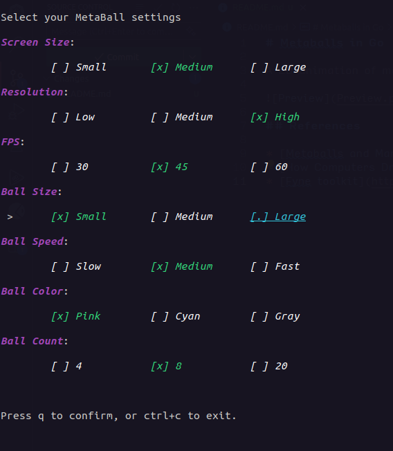
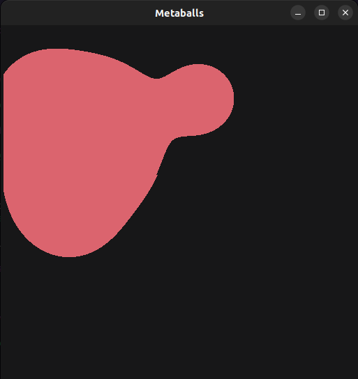

# Metaballs in Go

A 2D animation of moving metaballs, implemented with Go, Fyne toolkit and BubbleTea TUI , based on the marching square algorithm.

## Usage
### Linux
 ```bash
 ./metaballs
 ```

### Windows
 Open the `metaballs.exe` file

Then you can interact with the TUI using the keyboard to set your preferences:


After setting your preferences, press `q` to confirm and start the animation.



## References

* [Metaballs and Marching Squares](https://jamie-wong.com/2014/08/19/metaballs-and-marching-squares/), by Jamie Wong
* [How Computers Draw Weird Shapes](https://www.youtube.com/watch?v=6oMZb3yP_H8), on YouTube
* [Fyne toolkit](https://developer.fyne.io/)
* [Bubble Tea](https://github.com/charmbracelet/bubbletea)